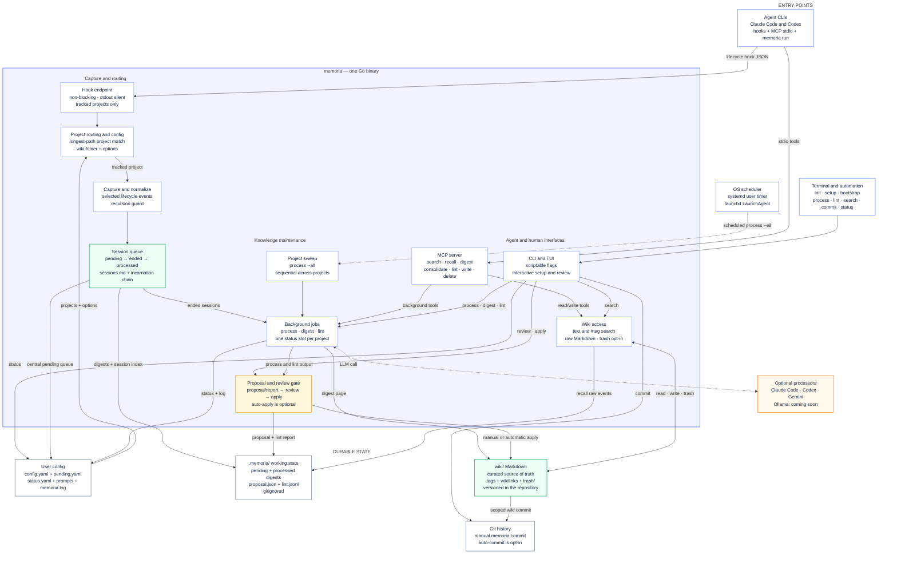

# Memoria architecture overview

> Hooks capture sessions; plain Markdown is curated memory; no database or embeddings.

## Flow in plain text

1. **Capture:** Claude Code or Codex invokes `memoria hook` with lifecycle JSON. Memoria resolves the current directory to a registered project, normalizes useful events, appends them to `.memoria/sessions/pending/`, and updates the central pending queue.
2. **Session lifecycle:** A real `session-end`, or the next session started in that project, marks queued digests as ended. Reopened processed sessions create a new incarnation linked to the previous digest.
3. **Consolidation:** `process`, the MCP background tools, or the OS scheduler collect ended sessions. A configured processor returns structured wiki pages; it never writes project files directly.
4. **Review and apply:** By default, processing writes `.memoria/proposal.json` for review. Applying it writes validated Markdown under `wiki/`, moves digests to `processed/`, removes queue entries, and deletes the proposal. `auto_apply` makes this automatic.
5. **Recall:** Humans use `search`; agents use MCP search and recall. Both read the project wiki, while recall can also assemble a handoff from raw session events and Git state.
6. **Versioning:** `wiki/` is meant to be committed. `memoria commit` scopes the commit to the wiki; `wiki_auto_commit` optionally commits applied writes automatically. `.memoria/` remains gitignored operational state.

The scheduler and detached commands reuse the same per-project background-job status slot. `process --all` sweeps registered projects sequentially because the shared YAML queue and status files are not transactionally locked.
